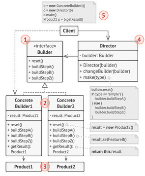
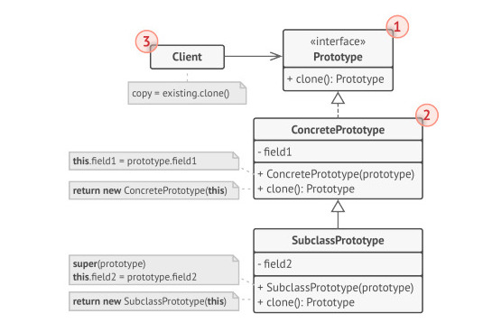

## Builder

### Descripción

Separa la **construcción** de un objeto complejo de su **representación final**, permitiendo construir el objeto paso a paso y producir distintas configuraciones del mismo proceso de construcción.

### El problema

Por ejemplo en un sistema para una hamburguesería. Una `Hamburguesa` tiene múltiples componentes: tipo de pan, cantidad de carne, presencia de queso, tipo de salsa, etc.":

```avaj
// Esto es lo que queremos EVITAR:
new Hamburguesa("Brioche", 2, true, "BBQ");
new Hamburguesa("Tradicional", 1, false, "Mostaza");
// Resulta difícil recordar el orden de los parámetros (¿cuál booleano era el queso?).
```
### La solución

Se desacopla la creación del objeto complejo introduciendo una interfaz `Builder` con pasos específicos y una clase `Director` que se encarga del orden las recetas (como "doble" o "sencilla"). De esta forma, el cliente le pide al director que construya un tipo de hamburguesa utilizando el constructor concreto, evitando constructores gigantes confusos y permitiendo ensamblar objetos complejos de forma clara, paso a paso y totalmente reutilizable.

### Estructura general



**Qué representa cada número de la figura:**

1. **La interfaz Constructora** (`Builder`) declara los pasos de construcción que comparten todos los tipos de constructores concretos.
2. **Los Constructores Concretos** (`HamburguesaBuilder`) ofrecen distintas implementaciones de esos pasos, manteniendo la instancia en preparación y entregando el resultado final.
3. **Los Productos** (`Hamburguesa`) son los objetos resultantes de la construcción.
4. **La clase Directora** (`Director`) define el orden en el que se ejecutan los pasos de construcción, permitiendo crear y reutilizar configuraciones específicas del proceso (como recetas "doble" o "sencilla").
5. **El Cliente** (`App`) asocia un constructor concreto con la clase directora y coordina el flujo para obtener las instancias configuradas.

---


### Código para probar
```avaj
public interface Builder {
    void reset();
    void buildPan(String pan);
    void buildCarne(int carne);
    void buildQueso(boolean queso);
    void buildSalsa(String salsa);
}

public class Director {
    private Builder builder;

    public Director(Builder builder) {
        this.builder = builder;
    }

    public void changeBuilder(Builder builder) {
        this.builder = builder;
    }

    public void make(String type) {
        this.builder.reset();

        if (type.equalsIgnoreCase("doble")) {
            this.builder.buildPan("Brioche");
            this.builder.buildCarne(2);
            this.builder.buildQueso(true);
            this.builder.buildSalsa("BBQ");

        } else if (type.equalsIgnoreCase("sencilla")) {
            this.builder.buildPan("Tradicional");
            this.builder.buildCarne(1);
        }
    }
}

public class Hamburguesa {
    private String pan = "Sin pan";
    private int carne = 0;
    private boolean queso = false;
    private String salsa = "Sin salsa";
    public void setPan(String pan) { 
        this.pan = pan; 
    }
    public void setCarne(int carne) { 
        this.carne = carne; 
    }
    public void setQueso(boolean queso) { 
        this.queso = queso; 
    }
    public void setSalsa(String salsa) { 
        this.salsa = salsa; 
    }

    public void mostrar() {
        System.out.println("Informe pedido");
        System.out.println("Pan: " + pan);
        System.out.println("Carne: " + carne);
        System.out.println("Queso: " + (queso ? "Sí" : "No"));
        System.out.println("Salsa: " + salsa);
    }
}

public class HamburguesaBuilder implements Builder {
    private Hamburguesa result;
    // Crea una nueva hamburguesa 
    public HamburguesaBuilder() {
        this.reset();
    }

    @Override
    public void reset() {
        this.result = new Hamburguesa();
    }

    @Override
    public void buildPan(String pan) {
        this.result.setPan(pan);
    }

    @Override
    public void buildCarne(int carne) {
        this.result.setCarne(carne);
    }

    @Override
    public void buildQueso(boolean queso) {
        this.result.setQueso(queso);
    }

    @Override
    public void buildSalsa(String salsa) {
        this.result.setSalsa(salsa);
    }
    // Devuelve el producto y reinicia para crear otro producto
    public Hamburguesa getResult() {
        Hamburguesa product = this.result;
        this.reset();
        return product;
    }
}
```

```avaj
public class App {
    public static void main(String[] args) {
        HamburguesaBuilder builder = new HamburguesaBuilder();
        Director director = new Director(builder);

        director.make("doble");
        Hamburguesa hamburguesaDoble = builder.getResult();
        hamburguesaDoble.mostrar();

        director.make("sencilla");
        Hamburguesa hamburguesaSencilla = builder.getResult();
        hamburguesaSencilla.mostrar();
    }
}
```

Salida esperada:

```
Informe pedido
Pan: Brioche
Carne: 2
Queso: true
Salsa: BBQ
Informe pedido
Pan: Tradicional
Carne: 1
Queso: false
Salsa: sin salsa
```

## Prototype

### Descripción

Permite copiar o clonar objetos existentes sin que el código dependa de sus clases concretas. Es ideal para crear nuevas instancias a partir de una plantilla ya configurada.

### El problema

Imagina que estás desarrollando un sistema de perfiles/pantallas de usuarios para una plataforma de streaming. Una vez configurada una pantalla con sus opciones de idioma y tipo de plan, crear un nuevo usuario o perfil similar requeriría volver a consultar o asignar individualmente cada uno de estos parámetros en el cliente. Si la clase tiene atributos privados o una jerarquía compleja (como perfiles infantiles con restricciones de contenido), instanciar manualmente cada duplicado genera código acoplado e ineficiente.

### La solución

Se define una interfaz prototipo (`PantallaPrototype`) con un método `clonar()`. Las clases concretas (`Pantalla` y `PantallaKids`) implementan dicho método utilizando un **constructor copia** internamente (`this`), lo que permite que el objeto se duplique a sí mismo de manera limpia manteniendo sus propiedades base intactas y dejando que el cliente altere únicamente los datos específicos (como el nombre del perfil).

### Estructura general



**Qué representa cada número de la figura:**

1. **La interfaz Prototipo** (`PantallaPrototype`): Declara los métodos de clonación que deben implementar todos los objetos clonables (generalmente un método `clone()` o `clonar()`).
2. **Los Prototipos Concretos y Subclases** (`Pantalla` y `PantallaKids`): Implementan el método de clonación copiando los datos del objeto actual hacia una nueva instancia mediante un constructor copia.
3. **El Cliente** (`App`): Solicita la creación de una copia llamando al método `clonar()` de un objeto prototipo existente en lugar de crearlo directamente desde cero.

---


### Código para probar

```java
public interface PantallaPrototype {
    Pantalla clonar();
}

public class Pantalla implements PantallaPrototype {

    private String nombre;
    private String idioma;
    private String plan;

    public Pantalla(String nombre, String idioma, String plan) {
        this.nombre = nombre;
        this.idioma = idioma;
        this.plan = plan;
    }

    // Constructor para copiar el prototipo
    public Pantalla(Pantalla prototipo) {
        this.nombre = prototipo.nombre;
        this.idioma = prototipo.idioma;
        this.plan = prototipo.plan;
    }

    public void setNombre(String nombre) {
        this.nombre = nombre;
    }

    @Override
    public Pantalla clonar() {
        return new Pantalla(this);
    }

    public void mostrar() {
        System.out.println("Nombre: " + nombre);
        System.out.println("Idioma: " + idioma);
        System.out.println("Plan: " + plan);
    }
}


public class PantallaKids extends Pantalla {

    private boolean restriccionContenido;

    public PantallaKids(String nombre, String idioma, String plan) {
        super(nombre, idioma, plan);
        this.restriccionContenido = true;
    }
    public PantallaKids(PantallaKids prototipo) {
        super(prototipo); // Llama al constructor copia de Pantalla
        this.restriccionContenido = prototipo.restriccionContenido;
    }

    @Override
    public PantallaKids clonar() {
        return new PantallaKids(this);
    }

    @Override
    public void mostrar() {
        super.mostrar();
        System.out.println("Restricción de contenido: " + restriccionContenido);
    }
}
```
```java
public class App {

    public static void main(String[] args) {

        //Pantalla base
        Pantalla pantalla1 = new Pantalla("Kevin","Español","Premium");

        // se crea una nueva pantalla clonando la configuración de la original
        Pantalla pantalla2 = pantalla1.clonar();
        
        //Modificamos el nombre en el clon sin alterar el original
        pantalla2.setNombre("Tio Alfredo");

        System.out.println("--- Pantalla 1 ---");
        pantalla1.mostrar();

        System.out.println("--- Pantalla 2 ---");
        pantalla2.mostrar();


        PantallaKids kids1 = new PantallaKids("Hijo", "Español", "Premium");
        PantallaKids kids2 = kids1.clonar();
        kids2.setNombre("Sobrino");
        System.out.println("--- Pantalla Kids 1 ---");
        kids1.mostrar();
        System.out.println("--- Pantalla Kids 2 ---");
        kids2.mostrar();
    
    }
}
```
Salida esperada:

```
--- Pantalla original ---
Nombre: Kevin
Idioma: Español
Plan: Premium

--- Pantalla clonada ---
Nombre: Tio Alfredo
Idioma: Español
Plan: Premium

--- Pantalla Kids 1 ---
Nombre: Hijo
Idioma: Español
Plan: Premium
Restricción de contenido: true

--- Pantalla Kids 2 ---
Nombre: Sobrino
Idioma: Español
Plan: Premium
Restricción de contenido: true
```